基于SpringBoot的高校危化试剂仓储系统（程序+论文）
=
- 完整代码获取地址：从戎源码网 ([https://armycodes.com/](https://armycodes.com/))
- 作者微信：19941326836  QQ：952045282 
- 承接计算机毕业设计、Java毕业设计、Python毕业设计、深度学习、机器学习
- 选题+开题报告+任务书+程序定制+安装调试+论文+答辩ppt 一条龙服务
- 所有选题地址https://github.com/nature924/allProject

一、项目介绍
---
基于Spring Boot框架实现的高校危化试剂仓储系统，系统包含两种角色：管理员、用户,系统分为前台和后台两大模块，主要功能如下。
### 用户功能：
- 个人中心：管理个人信息。
- 试剂管理：查看试剂信息、搜索试剂、添加试剂、编辑试剂、删除试剂等操作。
- 安全管理：查看试剂的安全信息、设置试剂的安全措施等操作。
- 存储管理：查看试剂的存储位置、调整试剂的存储位置等操作。
- 出入库管理：查看试剂的出入库记录、进行试剂的借用归还等操作。
- 使用记录管理：查看试剂的使用记录、记录试剂的使用情况等操作。
- 公告资讯管理：查看系统公告、发布和管理公告信息等操作。

### 管理员功能：
- 个人中心：管理个人信息。
- 管理员管理：管理系统管理员信息，包括添加管理员、编辑管理员、删除管理员等操作。
- 用户管理：管理系统用户信息，包括添加用户、编辑用户、删除用户等操作。
- 试剂管理：管理试剂信息，包括添加试剂、编辑试剂、删除试剂等操作。
- 安全管理：管理试剂的安全信息，包括设置试剂的安全措施、审核用户的安全申请等操作。
- 存储管理：管理试剂的存储位置，包括查看试剂的存储位置、调整试剂的存储位置等操作。
- 出入库管理：管理试剂的出入库记录，包括查看试剂的出入库记录、审核用户的借用归还申请等操作。
- 使用记录管理：管理试剂的使用记录，包括查看试剂的使用记录、记录试剂的使用情况等操作。
- 公告资讯管理：管理系统公告信息，包括发布和管理公告信息等操作。
- 基础数据管理：管理系统的基础数据，包括试剂分类、存储位置等数据的添加、编辑、删除等操作。

二、项目技术
---
- 编程语言：Java
- 数据库：MySQL
- 项目管理工具：Maven
- 前端技术：VUE、HTML、Jquery、Bootstrap
- 后端技术：Spring、SpringMVC、MyBatis

三、运行环境
---
- 操作系统：Windows、macOS都可以
- JDK版本：JDK1.8以上都可以
- 开发工具：IDEA、Ecplise、Myecplise都可以
- 数据库: MySQL5.7以上都可以
- Tomcat：任意版本都可以
- Maven：任意版本都可以

四、运行截图
---
### 论文截图：
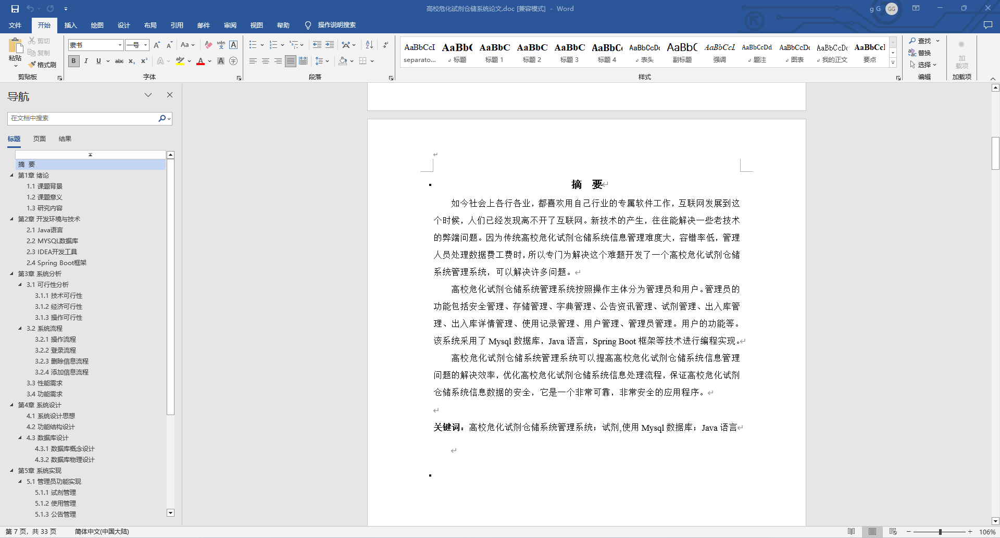
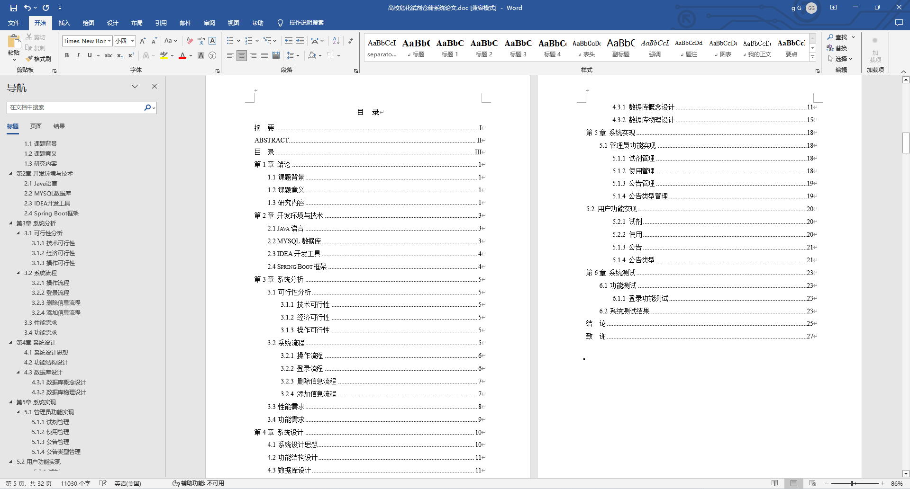

### 程序截图：
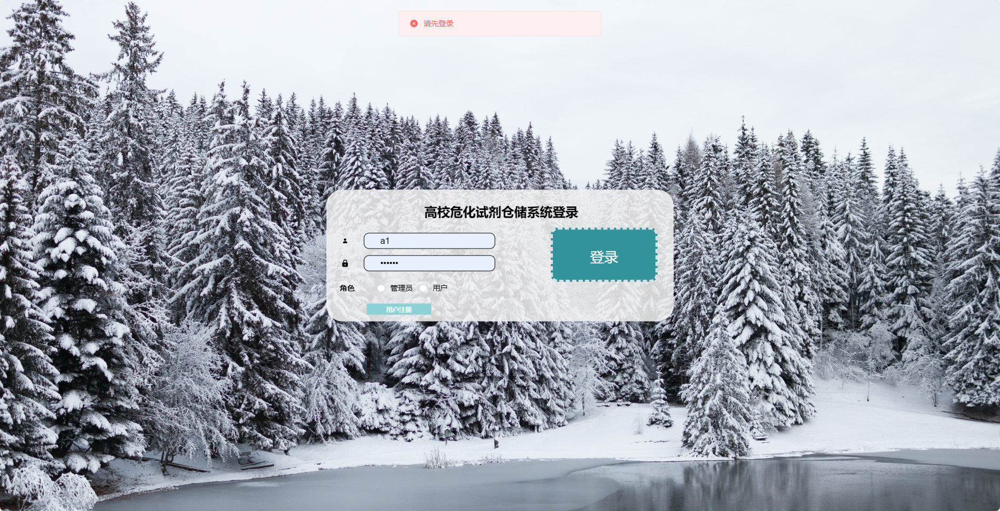
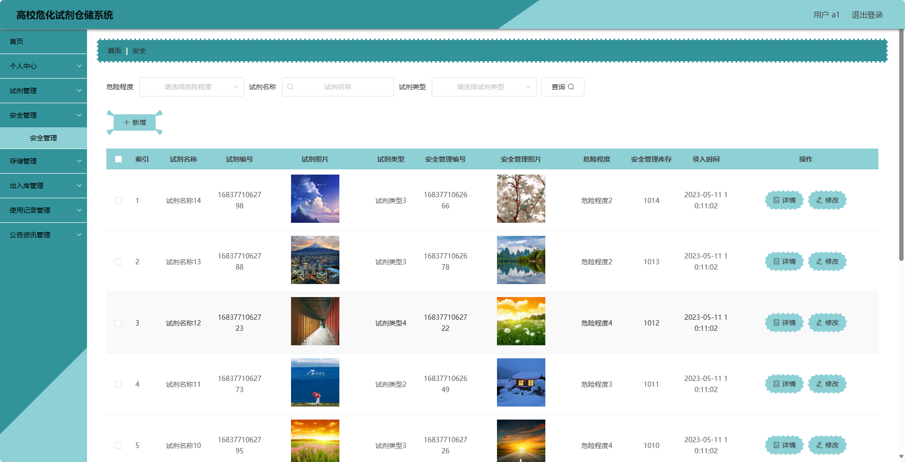
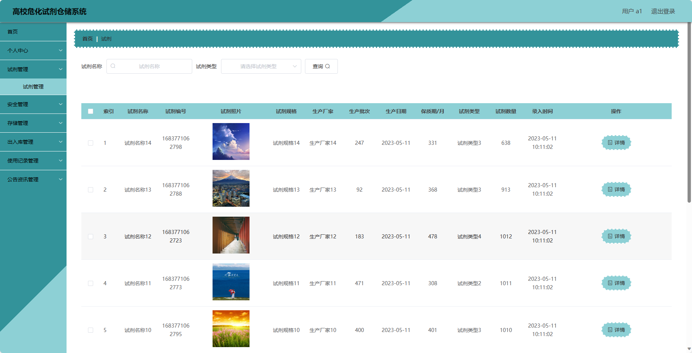
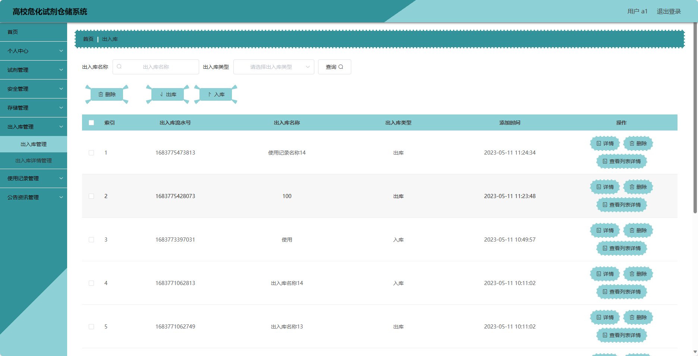
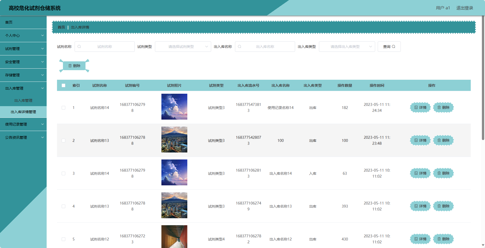
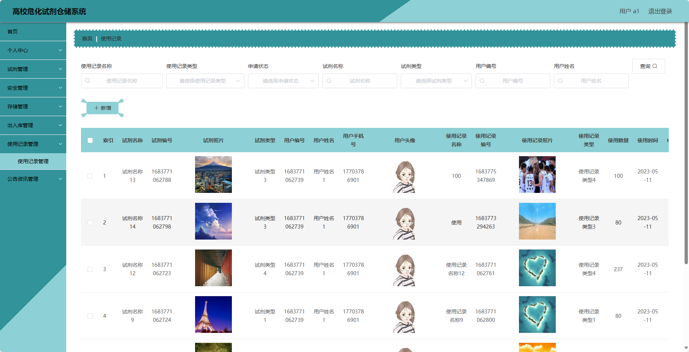
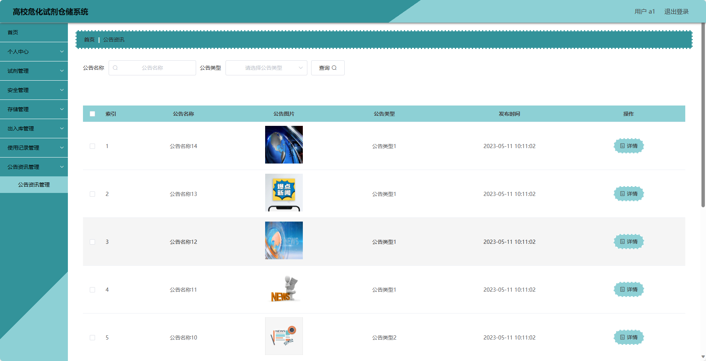
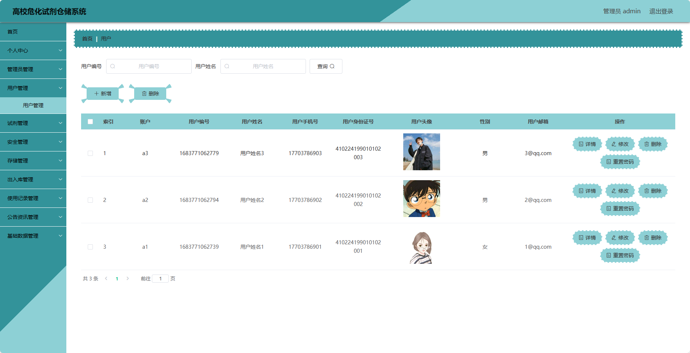
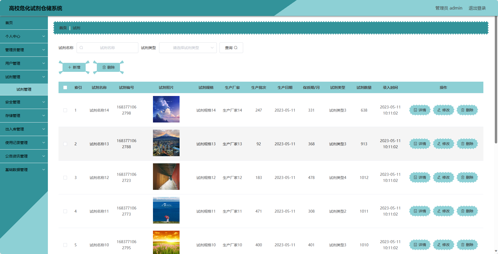
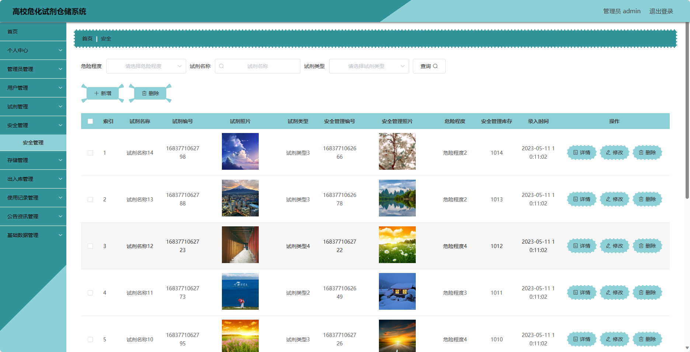

